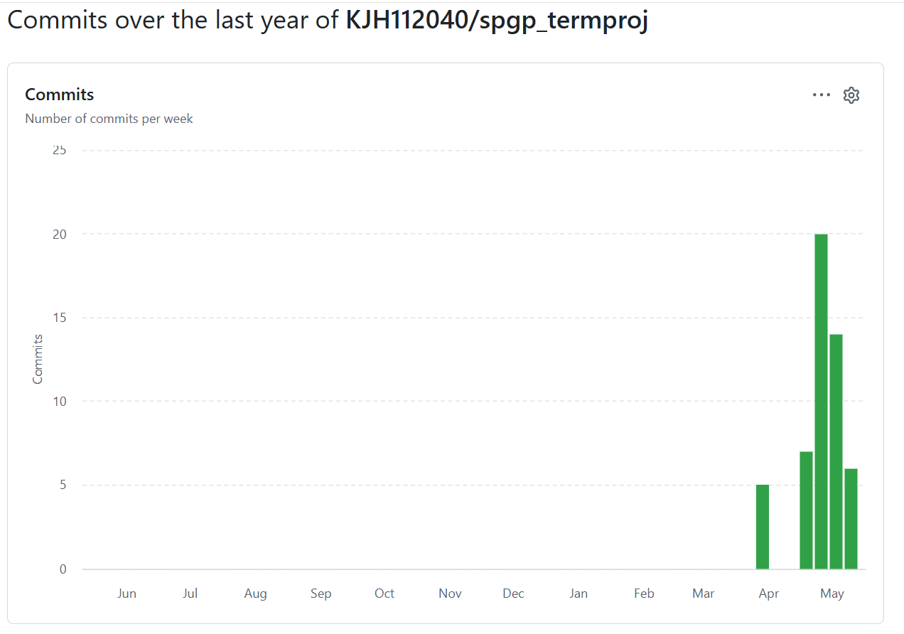

# 2차 발표
### 게임에 대한 간단한 소개
플래피 버드와 비슷한 형식의 게임으로,  
아래로 내려가는 캐릭터를 화면을 터치하여 위로 띄우면서 장애물을 피하는 간단한 형식의 게임

-----
### 현재까지의 진행 상황
| 개발 항목 | 진행률 |
| --- | :-: |
| 장애물 | 100% |
| 캐릭터 | 33% |
| 화면 구성 | 50%|
| 게임 시스템 | 80% |
| 캐릭터 선택 | 0% |
| 사운드 | 0% |
| 설정 | 0% |

-----
### 주별 commit

| 주차 | commit |
| --- | --- |
| 1주차 (4/6 ~ 4/12) | 0 |
| 2주차 (4/13 ~ 4/19) | 0 |
| 3주차 (4/20 ~ 4/26) | 13 |
| 4주차 (4/27 ~ 5/3) | 14 |
| 5주차 (5/4 ~ 5/10) | 20 |

-----
### Activity 구성
+ MainActitvity  
: 게임 타이틀 Activity,  
현재 캐릭터 선택 버튼, 설정 버튼, 시작 버튼으로 화면이 구성되어 있지만, 기능이 구현된 버튼은 시작 버튼 밖에 없음.
+ gameFlyActivity  
: 인게임 Activity,  
현재 구현된 Scene은 게임이 진행되는 MainScene과 중간에 잠시 게임을 멈출 수 있는 PauseScene이 있음. 
PauseScene은 진행하던 게임으로 돌아가는 버튼, 설정 버튼, 타이틀로 가는 버튼으로 구성되어 있으나,  
기능이 구현된 버튼은 게임으로 돌아가는 버튼과 타이틀로 가는 버튼 밖에 없음.

-----
### MainScene에 포함된 GameObject
+ Player 
: 플레이어가 조종할 수 있는 캐릭터로 화면 터치를 하지 않으면 계속 밑으로 하강함. 
능력 버튼이 눌렸을 경우, 스킬을 사용할 수 있는 조건을 만족하면 사용함.
  + Gauge: 이를 통해 Player 내 hp가 얼마나 남았는지 캐릭터 위에 표시함.
+ HurdleManager: 장애물인 Hurdle을 소환하고, Hurdle간 간격이나 Hurdle의 속도, Hurdle의 등장 주기 등을 조정함.
  + TopHurdle: 위쪽 Hurdle, Player가 자신을 지나쳤을 때 점수를 줄 수 있는지에 따라 1또는 0을 반환함.
  + BottomHurdle: 아랫쪽 Hurdle
+ CollisionChecker 
: Player와 Hurdle 간 충돌이 생기면 Player의 체력을 깎고, Hurdle을 지나쳤을 때 TopHurdle에서의 반환값을 Score에 더함. 
Player가 화면 하단으로 떨어질 경우 게임을 종료. 현재 구현에서는 바로 타이틀 화면으로 가지만, GameOver화면으로 전환되게 구현할 예정
+ Score: 상단에 표시되는 점수
+ Button: skill버튼과 pause버튼이 있음. skill 버튼을 눌러 Player가 가진 능력을 사용. Pause 버튼으로 잠시 게임을 일시 중단함.(PauseScene으로 넘어감.)

-----
##### 고민하고 있는 것
+ 캐릭터들의 능력치 
: 현재 기본 캐릭터의 이동 범위가 초반 기둥 사이에 알맞게 들어감. 
기본 캐릭터보다 이동범위가 커서 한 번에 빠르게 올라가고 내려가는 캐릭터의 난이도가 걱정됨.  
기둥을 지나칠 때 화면을 터치하지 않으면 밑기둥에 hp를 잃고 터치해도 윗기둥에 hp를 잃는 상황 발생 우려.  
심지어 점점 갈수록 기둥 사이가 좁아지게 설계하여 기본 캐릭터로도 발생할 수 있는 경우로 예상됨.
+ 설정 구현 
: 설정을 타이틀 화면에서도 할 수 있고, 인게임 내에서도 할 수 있게 하고 싶은데 
게임 내에서는 Scene으로 돌아가고 타이틀 화면은 SceneStack에 포함되지 않는 Activity이기 때문에 구현 방식이 다를 것 같아서 어떻게 구현해야 하는지 고민 중.
